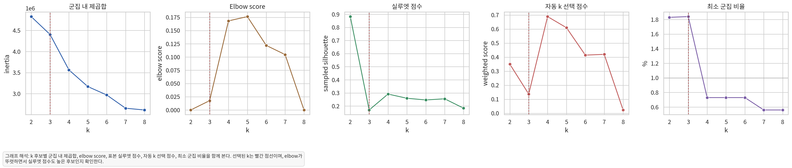
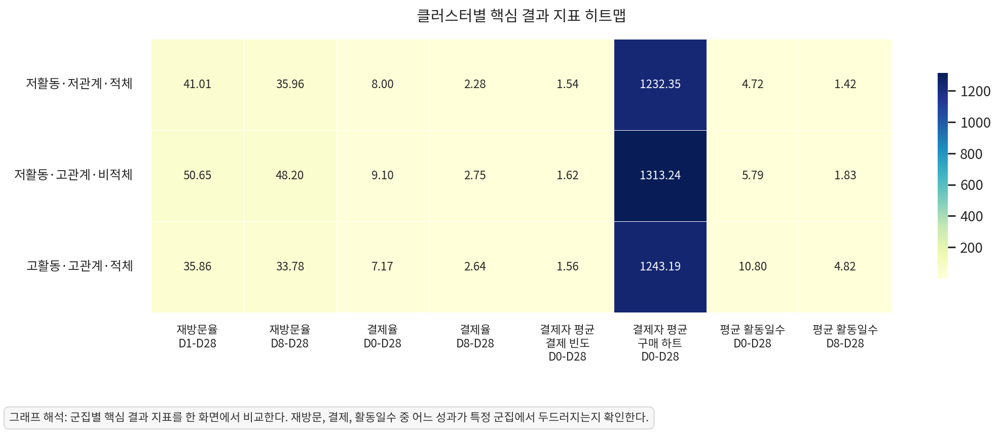
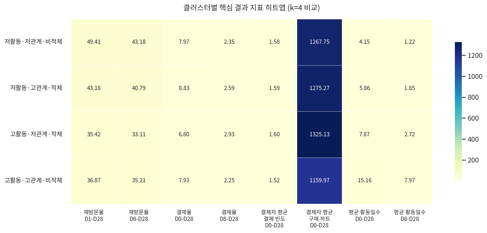

# Suhyun Analysis Outputs

Codeit DA 12기 파이널 프로젝트에서 수행한 유저 행동 분석 결과 공유용 브랜치입니다.

이 브랜치에는 대용량 원천 데이터와 유저 단위 전체 processed CSV를 제외하고, GitHub에서 바로 검토하기 좋은 요약 표와 시각화 결과만 포함했습니다.

## 분석 목적

초기 가입 후 D0-D7 기간의 행동을 기준으로 유저를 나누고, 각 그룹이 이후 재방문, 결제, 활동일수와 어떻게 연결되는지 확인했습니다.

이번 업로드에는 두 가지 결과가 포함되어 있습니다.

- `sender_behavior_datamart_outputs`: 발신 행동 중심 유저 데이터마트 요약
- `three_axis_clustering_outputs`: 발신 행동, 수신 반응, 관계망 환경을 함께 사용한 3축 클러스터링 결과

## 폴더 구조

```text
analysis/
  sender_behavior_datamart_outputs/
    sender_behavior_datamart_dictionary.csv
    sender_behavior_datamart_sender_cluster_profile.csv
    sender_behavior_datamart_summary.csv

  three_axis_clustering_outputs/
    figures/
    tables/
```

대용량 파일은 `.gitignore`로 제외했습니다.

- `analysis/sender_behavior_datamart_outputs/sender_behavior_user_datamart.csv`
- `analysis/three_axis_clustering_outputs/processed/`

## 3축 클러스터링 요약

클러스터링 입력은 D0-D7 초기 행동 변수로 제한하고, 재방문/결제/활동일수는 사후 결과 지표로 분리했습니다.

사용한 3개 축은 다음과 같습니다.

- 발신 행동축: 투표 발신, 질문 시작/완료/스킵 등
- 수신 반응축: 투표 수신, 수신 이후 출석/포인트 사용/결제 등
- 관계망 환경축: 친구 수, 후보 노출, 같은 반/학년 활성도, 미확인 Ping 등

기본 보고용 결과는 `k=3`입니다. `k=4` 결과도 비교용으로 함께 생성했습니다.



## k 선택 기준

`k=4`는 일부 지표에서 더 좋아 보이지만, 최소 군집 비율이 0.73%로 설정 기준인 1%보다 작았습니다. 그래서 보고용 기본값은 해석 가능성과 최소 군집 규모를 함께 고려해 `k=3`으로 유지했습니다.

| k | 표본 실루엣 | 최소 군집 비율 | 선택 여부 |
|---:|---:|---:|:---|
| 3 | 0.1696 | 1.84% | 기본 보고 |
| 4 | 0.2912 | 0.73% | 비교용 |

## k=3 세그먼트

| 세그먼트 | 유저 수 | 비중 | D1-D28 재방문율 | D0-D28 결제율 | D0-D28 평균 활동일수 |
|---|---:|---:|---:|---:|---:|
| 저활동·저관계·적체 | 338,658 | 52.21% | 41.01% | 8.00% | 4.72일 |
| 저활동·고관계·비적체 | 298,048 | 45.95% | 50.65% | 9.10% | 5.79일 |
| 고활동·고관계·적체 | 11,905 | 1.84% | 35.86% | 7.17% | 10.80일 |

핵심적으로는 `저활동·고관계·비적체` 그룹이 재방문율과 결제율 모두 가장 높았습니다. 즉, 초기 직접 행동이 많지 않더라도 관계망 환경이 좋고 미확인 Ping 적체가 낮은 유저가 더 좋은 사후 성과를 보였습니다.

반대로 `고활동·고관계·적체` 그룹은 평균 활동일수는 가장 높지만 재방문율과 결제율은 가장 높지 않았습니다. 활동량 자체보다 어떤 관계망 환경과 알림/수신 상태에 놓였는지가 더 중요할 수 있습니다.



## k=4 비교 결과

`k=4`에서는 고활동 그룹이 더 세분화됩니다.

| 세그먼트 | 유저 수 | 비중 | D1-D28 재방문율 | D0-D28 결제율 | D0-D28 평균 활동일수 |
|---|---:|---:|---:|---:|---:|
| 저활동·저관계·비적체 | 239,241 | 36.89% | 49.41% | 7.97% | 4.15일 |
| 저활동·고관계·적체 | 396,982 | 61.20% | 43.18% | 8.83% | 5.86일 |
| 고활동·저관계·적체 | 7,674 | 1.18% | 35.42% | 6.80% | 7.87일 |
| 고활동·고관계·비적체 | 4,714 | 0.73% | 36.87% | 7.93% | 15.16일 |

비교 관점에서는 `고활동·고관계·비적체`라는 흥미로운 그룹이 분리되지만, 전체의 0.73%라 보고용 대표 세그먼트로 쓰기에는 규모가 작습니다.



## 주요 산출물

### 시각화

- [k 선택 지표](analysis/three_axis_clustering_outputs/figures/three_axis_cluster_k_selection.png)
- [k=3 PCA 2D 분포](analysis/three_axis_clustering_outputs/figures/three_axis_cluster_pca_2d.png)
- [k=3 세그먼트 결과 heatmap](analysis/three_axis_clustering_outputs/figures/three_axis_cluster_outcome_heatmap.png)
- [k=4 PCA 2D 분포](analysis/three_axis_clustering_outputs/figures/k4_three_axis_cluster_pca_2d.png)
- [k=4 세그먼트 결과 heatmap](analysis/three_axis_clustering_outputs/figures/k4_three_axis_cluster_outcome_heatmap.png)

### 결과표

- [k 선택 지표 CSV](analysis/three_axis_clustering_outputs/tables/three_axis_cluster_k_selection_metrics.csv)
- [k=3 클러스터 결과 요약](analysis/three_axis_clustering_outputs/tables/three_axis_cluster_outcome_summary.csv)
- [k=3 클러스터명 매핑](analysis/three_axis_clustering_outputs/tables/three_axis_cluster_label_mapping.csv)
- [k=4 클러스터 결과 요약](analysis/three_axis_clustering_outputs/tables/k4_three_axis_cluster_outcome_summary.csv)
- [k=4 클러스터명 매핑](analysis/three_axis_clustering_outputs/tables/k4_three_axis_cluster_label_mapping.csv)
- [최종 해석 Markdown](analysis/three_axis_clustering_outputs/tables/three_axis_final_interpretation.md)

## 발신 행동 데이터마트 요약

`sender_behavior_datamart_outputs`는 발신 행동 중심 데이터마트를 GitHub 검토용으로 줄인 결과입니다.

- 총 유저 수: 677,085명
- 발신 행동 제외 활동일수 지표 포함
- 발신 클러스터 라벨 포함
- 대용량 유저 단위 데이터마트 CSV는 GitHub 업로드에서 제외

## 주의사항

이 분석은 관찰 데이터 기반 세그먼트 분석입니다. 특정 행동이 재방문이나 결제를 직접 유발한다고 단정하기보다는, 초기 행동/관계망 상태별로 이후 성과가 어떻게 달라지는지 비교하는 용도로 해석해야 합니다.

또한 결제 금액은 사용 가능한 결제 관련 컬럼을 기반으로 한 추정 구매 하트 수입니다. 실제 매출액과 동일한 값으로 해석하지 않습니다.
